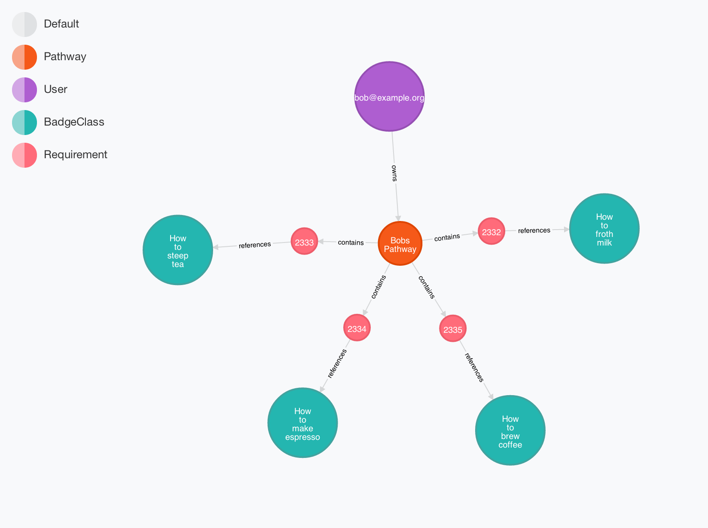

# Data Model

This document (and the data model) is a WIP, YMMV, BYOB, etc.

Some discussion of the data model is probably warranted, especially since Neo4j is 
schema-less, and there are some implicit constraints on the data not represented in 
the code (yet).

## Pathways

Pathways aren't strictly graphs. In their loosest form, pathway are just a bag of
badge classes that can be earned in any order to reach some end goal. The
discovery app adds a layer of physical arrangement that allows a human to represent
constraints implicitly, but to start those constraints won't necessarily be stored
in the data model (although we do expect to begin adding them in later).

### Pathway Requirements

Additionally, a badge on a pathway isn't actually a badge—it's an indicator of a requirement that the user earn a badge of a certain badge class. It can be fulfilled or unfulfilled at any given moment, and in the future might even represent a requirement that the user earn *one of several* badge classes to move forward, for example. 

### The Model

With those things in mind, our basic data model looks like this:

A `User` owns a `Pathway` which contains `Requirement`s that reference `BadgeClass`es. More detail on each node type follows:

**User**

* Attributes: `email`
* Constraints: `email` is unique

**Pathway**

* Attributes: `name`
* Constraints: not owned by multiple `User`s (pledging a pathway clones it)

**Requirement**

* Attributes: `x`, `y`
* Constraints: not shared between `Pathway`s

**BadgeClass**

* Attributes: `name`, `image`
* Constraints: none

This provides what we need for the minimal "bag of badges" case, in that each badge
class in a pathway has a link to the root `Pathway` node through the `Requirement`
that records its `x`, `y` position in the grid. 

Prerequisite-style constraints can be added later through relationships between 
`Requirement`s, keeping them localized to a particular `User`s pathway. Earn-one-of-many style constraints can be added by expanding `Requirement` nodes
to have additional sub-types, one of which references several `BadgeClass`es.
